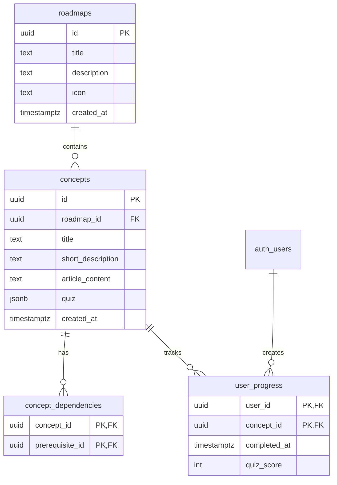

# 🌳 Knowledge Tree

<p align="center">
  
  
  
  
  <b>An interactive, learning platform that transforms complex subjects into visual, progressive learning journeys.</b><br><a href="https://knowledgetreex.vercel.com/" target="_blank">Visit Now</a> <br>

</p>


[](https://nextjs.org/)
[](https://reactjs.org/)
[](https://www.typescriptlang.org/)
[](https://supabase.com/)
[](https://tailwindcss.com/)

## 🚀 Overview

Knowledge Tree revolutionizes learning by presenting complex subjects as interactive, visual roadmaps. Users navigate through interconnected concepts, unlocking new knowledge progressively as they master prerequisites. Each concept features AI-generated articles and quizzes, ensuring comprehensive understanding before advancement.

### ✨ Key Features

🗺️ **Interactive Visual Roadmaps** - Navigate learning paths through beautiful, node-based visualizations powered by React Flow  
🔓 **Progressive Knowledge Unlocking** - Master prerequisites to unlock advanced concepts  
🤖 **AI-Generated Content** - Rich articles and adaptive quizzes created using DeepSeek API  
👤 **Secure Authentication** - Email/password and Google OAuth via Supabase Auth  
📊 **Real-time Progress Tracking** - Monitor learning journey with detailed completion analytics  
🎨 **Modern Responsive Design** - Clean, professional UI optimized for all devices  
⚡ **High Performance** - Built with Next.js 15 and optimized for speed  

## 🏗️ Architecture

### Technology Stack

| Layer | Technology | Purpose |
|-------|------------|---------|
| **Frontend** | Next.js 15 + React 19 + TypeScript | Modern, type-safe web application |
| **Backend** | Supabase | PostgreSQL database, authentication, real-time subscriptions |
| **Styling** | Tailwind CSS 4 | Utility-first CSS framework with modern design tokens |
| **Visualization** | React Flow | Interactive node-based roadmap visualization |
| **AI Integration** | DeepSeek API | Content generation for articles and quizzes |
| **Icons** | Lucide React + Heroicons | Consistent iconography |

### Database Schema



## 🛠️ Setup & Installation

### Prerequisites

- **Node.js** 18+ and npm
- **Supabase** account and project
- **DeepSeek API** key

### 1️⃣ Clone & Install

```bash
git clone https://github.com/LikhithSP/Knowledge-Tree.git
cd Knowledge-Tree
npm install
```

### 2️⃣ Database Setup

1. Create a new project at [Supabase](https://supabase.com)
2. Navigate to **SQL Editor** in your dashboard
3. Execute the schema from `database/schema.sql`
4. (Optional) Enable **Google OAuth**:
   - Go to **Authentication > Providers**
   - Enable Google provider with your OAuth credentials

### 3️⃣ Environment Configuration

Create `.env.local` in the project root:

```env
# Supabase Configuration
NEXT_PUBLIC_SUPABASE_URL=your_supabase_project_url
NEXT_PUBLIC_SUPABASE_ANON_KEY=your_supabase_anon_key
SUPABASE_SERVICE_ROLE_KEY=your_supabase_service_role_key

# AI Content Generation
DEEPSEEK_API_KEY=your_deepseek_api_key

# Environment
NODE_ENV=development
```

### 4️⃣ Content Generation (Optional)

Generate sample learning content:

```bash
# Generate all roadmaps and content
npm run generate-all-content

# Or generate specific domains
npm run create-ai-content
npm run create-datascience-content
npm run create-cybersecurity-content
```

### 5️⃣ Development Server

```bash
npm run dev
```

Visit [http://localhost:3000](http://localhost:3000) to see your application.

## 📁 Project Structure

```
Knowledge-Tree/
├── src/
│   ├── app/                    # Next.js 15 App Router
│   │   ├── auth/              # Authentication pages
│   │   ├── dashboard/         # Main dashboard
│   │   ├── roadmap/          # Learning roadmap interface
│   │   └── globals.css       # Global styles
│   ├── lib/                   # Utilities and configurations
│   │   └── supabase/         # Supabase client setup
│   └── types/                # TypeScript type definitions
├── scripts/                   # Content generation scripts
├── database/                  # Database schema and migrations
├── public/                    # Static assets
└── ...config files
```

## 🎯 Available Scripts

| Script | Description |
|--------|-------------|
| `npm run dev` | Start development server with Turbopack |
| `npm run build` | Build production application |
| `npm run start` | Start production server |
| `npm run lint` | Run ESLint for code quality |
| `npm run generate-all-content` | Generate all learning roadmaps |
| `npm run cleanup-duplicates` | Remove duplicate content |
| `npm run remove-empty-roadmaps` | Clean up empty roadmaps |

## 🎨 Design System

The application features a modern, cohesive design system:

- **Color Palette**: Gradient backgrounds with yellow accent theme
- **Typography**: Clean, readable fonts optimized for learning content
- **Components**: Reusable UI components with consistent styling
- **Responsive**: Mobile-first design that works on all screen sizes
- **Accessibility**: WCAG compliant with proper contrast ratios

## 🔒 Security Features

- **Row Level Security (RLS)** on user progress data
- **Protected routes** with middleware authentication
- **Secure API endpoints** with proper validation
- **OAuth integration** for streamlined authentication
- **Environment variable protection** for sensitive data

## 🚦 Production Deployment

### Vercel (Recommended)

1. Connect your GitHub repository to Vercel
2. Configure environment variables in Vercel dashboard
3. Deploy automatically on push to main branch

### Manual Deployment

```bash
npm run build
npm run start
```

## 🤝 Contributing

We welcome contributions! Please follow these steps:

1. Fork the repository
2. Create a feature branch: `git checkout -b feature/amazing-feature`
3. Commit changes: `git commit -m 'Add amazing feature'`
4. Push to branch: `git push origin feature/amazing-feature`
5. Open a Pull Request

## 📄 License

This project is licensed under the MIT License - see the [LICENSE](LICENSE) file for details.

## 🙏 Acknowledgments

- **Supabase** for the excellent backend infrastructure
- **Vercel** for seamless deployment platform
- **React Flow** for beautiful interactive diagrams
- **DeepSeek** for AI-powered content generation
- **Tailwind CSS** for the utility-first styling approach

---

<div align="center">


Made with ❤️ by [LikhithSP](https://github.com/LikhithSP)

</div>
